# Preliminary Results — STM of DAACS Self-Reflection Essays

**Generated:** 2026-08-27 by `scripts/build_results.R`. Regenerate rather than edit by hand.

> ## ⚠️ Preliminary — not for publication
>
> These results are a working record of what the corrected pipeline produces. They have not been through statistical review, replication, or the interpretive work that turns model output into findings. Several inputs are still provisional — the topic labels most of all. **Do not cite, circulate outside the project, or treat any number here as a finding.**
>
> These are exploratory, hypothesis-generating results. Every covariate was tested against all twelve topics, so p-values are reported after Benjamini-Hochberg adjustment within each covariate family, controlling the false discovery rate at 0.05. Multi-term covariates (the age spline, and race across its seven levels) are assessed with one joint test per topic rather than one test per coefficient. Adjustment narrows what may be claimed; it does not make this a confirmatory study. No effect reported here should be treated as established without pre-registered replication.

## 1. Corpus

Student self-reflection essays collected through DAACS at three institutions, cleaned of essay-prompt boilerplate and filtered to submissions carrying at least 50 unique words.

| Quantity | Value |
|---|---|
| Documents | 8210 |
| Vocabulary terms | 1250 |
| Topics (K) | 12 |

### Composition

**institution**

| institution | documents | percent |
|---|---|---|
| WG | 6180 | 75.2 |
| EC | 1820 | 22.1 |
| Alb | 218 | 2.7 |

**gender**

| gender | documents | percent |
|---|---|---|
| F | 4410 | 53.7 |
| M | 3800 | 46.3 |

**race**

| race | documents | percent |
|---|---|---|
| White | 6000 | 73.1 |
| Black or African American | 1010 | 12.3 |
| Latinx | 472 | 5.7 |
| Two or More Races | 334 | 4.1 |
| Asian | 263 | 3.2 |
| American Indian or Alaska Native | 69 | 0.8 |
| Native Hawaiian or Other Pacific Islander | 56 | 0.7 |

**first_gen**

| first_gen | documents | percent |
|---|---|---|
| FALSE | 4610 | 56.1 |
| TRUE | 2970 | 36.2 |
| UNKNOWN | 632 | 7.7 |

| Statistic | Age |
|---|---|
| Min. | 17 |
| 1st Qu. | 26 |
| Median | 32 |
| Mean | 33.21 |
| 3rd Qu. | 39 |
| Max. | 75 |

## 2. Models

Five specifications were fitted at K = 12. Results below come from `stm.p.12`, the prevalence-only `stm()` model, which is the model every covariate analysis and the topic network use. The content model (`stm.c.12`) supplies the per-gender vocabulary comparisons.

| Object | Fitted_by | Specification |
|---|---|---|
| stm.model.12 | manyTopics() | prevalence |
| content_prev.model.k12 | selectModel() | prevalence + content |
| stm.pc.12 | stm() | prevalence + content |
| stm.p.12 | stm() | prevalence |
| stm.c.12 | stm() | content |

Prevalence formula: `~gender + race + first_gen + s(age) + gender * s(age)` · content formula: `~gender`

Every fit is seeded; see `stm_models_final.rmd` for the seed per family.

## 3. Topics

Labels are **working names**, assigned by hand from `labelTopics()` output and exemplar essays. Topic numbering is an artifact of this particular fit and carries no meaning across values of K or across re-fits.

| Topic | Label | Mean prevalence (%) |
|---|---|---|
| 9 | Getting it Right Getting it Done | 16.1 |
| 8 | Time Management | 12.5 |
| 1 | Areas for Improvement | 11.4 |
| 7 | Transferable Strategies & Academic Success | 10 |
| 4 | Returning Learners-Degree Completion | 8.65 |
| 12 | Managing Distractions | 7.79 |
| 11 | Applying and Retaining Subject Matter | 7.43 |
| 6 | Confirmation and Readiness | 6.79 |
| 5 | Improving Math Skills | 5.64 |
| 3 | Test Anxiety | 5.48 |
| 10 | Adjusting Ones Mindset | 4.17 |
| 2 | Developing Writing Skills | 4.03 |

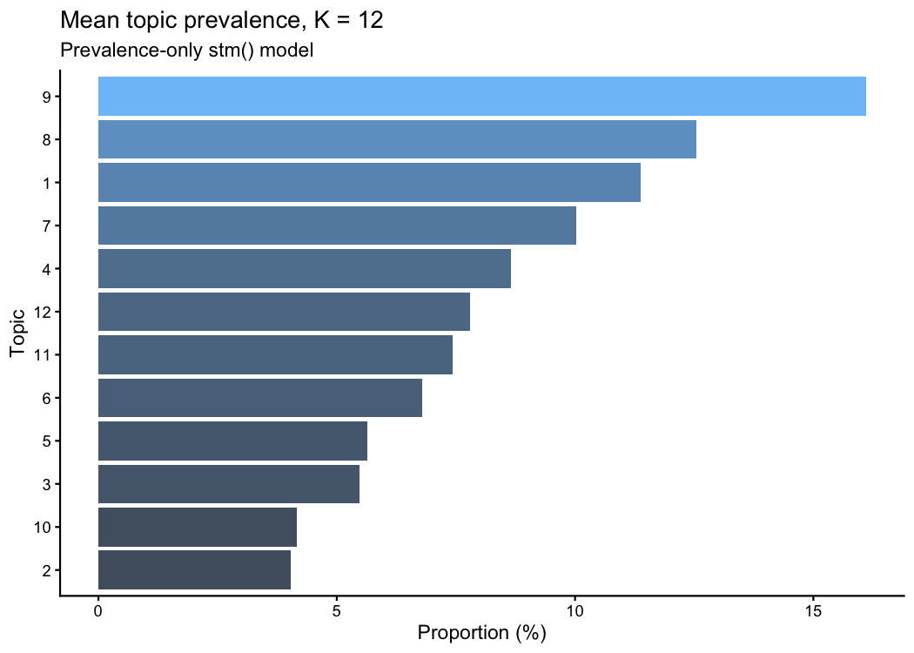

*Mean topic prevalence across the corpus*

### Top words by weighting

All four weightings are shown deliberately. `prob` and `frex` favour frequent terms; `lift` and `score` surface the low-frequency, distinctive terms that identify a topic's subject. Reading only the first two has already produced one wrong conclusion in this project.

**Probability**

| Topic | Label | Top 10 words |
|---|---|---|
| 1 | Areas for Improvement | learn, evalu, improv, assign, plan, use, can, ask, monitor, help |
| 2 | Developing Writing Skills | write, read, will, use, word, math, essay, just, paper, one |
| 3 | Test Anxiety | test, anxieti, help, take, studi, will, exam, feel, techniqu, posit |
| 4 | Returning Learners-Degree Completion | school, life, degre, work, year, will, colleg, time, class, famili |
| 5 | Improving Math Skills | area, improv, assess, weak, strength, skill, need, strong, see, well |
| 6 | Confirmation and Readiness | manag, high, categori, three, evalu, section, environ, monitor, plan, rang |
| 7 | Transferable Strategies & Academic Success | success, student, goal, skill, learn, person, educ, abil, achiev, provid |
| 8 | Time Management | will, time, help, manag, need, plan, studi, cours, work, set |
| 9 | Getting it Right Getting it Done | thing, get, need, can, work, know, help, make, time, alway |
| 10 | Adjusting Ones Mindset | mindset, learn, growth, can, believ, intellig, posit, abil, chang, challeng |
| 11 | Applying and Retaining Subject Matter | learn, materi, inform, understand, studi, subject, new, question, will, cours |
| 12 | Managing Distractions | time, studi, manag, work, distract, environ, can, task, find, day |

**FREX**

| Topic | Label | Top 10 words |
|---|---|---|
| 1 | Areas for Improvement | assign, evalu, ask, monitor, approach, suggest, list, learn, way, best |
| 2 | Developing Writing Skills | write, word, essay, paper, math, read, text, research, written, book |
| 3 | Test Anxiety | test, anxieti, relax, exam, techniqu, worri, stress, self-talk, prepar, anxious |
| 4 | Returning Learners-Degree Completion | year, degre, job, children, famili, life, bachelor, school, attend, busi |
| 5 | Improving Math Skills | area, weak, assess, strength, improv, identifi, surpris, strong, recommend, tool |
| 6 | Confirmation and Readiness | categori, three, rang, section, high, four, orient, efficaci, seek, broken |
| 7 | Transferable Strategies & Academic Success | achiev, individu, success, profession, educ, must, necessari, strateg, factor, academ |
| 8 | Time Management | will, set, cours, stay, mentor, time, asid, schedul, ensur, track |
| 9 | Getting it Right Getting it Done | thing, get, someth, dont, know, realli, done, alway, sure, everyth |
| 10 | Adjusting Ones Mindset | growth, intellig, mindset, fix, mistak, view, chang, mix, enjoy, grow |
| 11 | Applying and Retaining Subject Matter | materi, subject, concept, inform, retain, topic, comprehend, grasp, method, fulli |
| 12 | Managing Distractions | phone, procrastin, distract, interrupt, minut, quiet, hour, disturb, project, place |

**Lift**

| Topic | Label | Top 10 words |
|---|---|---|
| 1 | Areas for Improvement | frequenc, brainstorm, self-monitor, suppos, assign, approach, list, self-evalu, react, schoolwork |
| 2 | Developing Writing Skills | writer, english, paper, essay, word, write, written, reader, languag, paragraph |
| 3 | Test Anxiety | irrat, breath, relax, test, self-talk, calm, cope, reliev, anxieti, allevi |
| 4 | Returning Learners-Degree Completion | nurs, dream, bachelor, mother, child, older, year, young, age, ago |
| 5 | Improving Math Skills | mathemat, equat, weaker, weakest, area, link, weak, retak, strength, calcul |
| 6 | Confirmation and Readiness | subcategori, sub-categori, broken, categori, sub, help-seek, efficaci, four, three, meta |
| 7 | Transferable Strategies & Academic Success | perceiv, pursuit, align, individu, profession, integr, element, attribut, imper, foundat |
| 8 | Time Management | alloc, mentor, frame, allot, asid, manner, contact, coursework, cours, schedul |
| 9 | Getting it Right Getting it Done | stuff, till, realli, everyth, okay, done, dont, thing, someth, get |
| 10 | Adjusting Ones Mindset | mix, intellig, growth, fix, embrac, exhibit, mindset, view, belief, persist |
| 11 | Applying and Retaining Subject Matter | data, diagram, absorb, concept, retent, grasp, retain, memor, subject, paus |
| 12 | Managing Distractions | principl, nois, chunk, televis, media, electron, procrastin, music, desk, phone |

**Score**

| Topic | Label | Top 10 words |
|---|---|---|
| 1 | Areas for Improvement | frequenc, learn, assign, monitor, evalu, improv, ask, approach, suggest, plan |
| 2 | Developing Writing Skills | writer, write, read, math, word, paper, essay, english, languag, written |
| 3 | Test Anxiety | irrat, anxieti, test, relax, exam, techniqu, self-talk, help, posit, studi |
| 4 | Returning Learners-Degree Completion | nurs, degre, year, school, famili, life, children, class, job, kid |
| 5 | Improving Math Skills | mathemat, area, assess, improv, weak, strength, identifi, surpris, equat, recommend |
| 6 | Confirmation and Readiness | subcategori, categori, manag, high, section, three, rang, masteri, orient, environ |
| 7 | Transferable Strategies & Academic Success | perceiv, success, goal, student, educ, achiev, person, provid, skill, individu |
| 8 | Time Management | alloc, will, time, manag, cours, studi, set, schedul, need, help |
| 9 | Getting it Right Getting it Done | stuff, thing, get, someth, know, realli, need, dont, sure, make |
| 10 | Adjusting Ones Mindset | mix, mindset, growth, intellig, fix, mistak, self-efficaci, posit, learn, view |
| 11 | Applying and Retaining Subject Matter | data, materi, learn, inform, subject, understand, studi, concept, retain, question |
| 12 | Managing Distractions | principl, distract, studi, time, manag, environ, phone, hour, procrastin, day |

## 4. Covariate effects on topic prevalence

Estimated with `estimateEffect(uncertainty = "Global")` against `stm.p.12`.

### 4.1 How many tests, and how many survive adjustment

Counted the way the code filters them, the main-effects set is **228 hypotheses** — 12 for gender, 72 for race, 24 for first_gen, 120 for age. Race and first-generation status contribute one term per contrast against their reference level, and age contributes ten because `s(age)` expands to a spline. At an uncorrected 0.05 roughly 11 terms would clear the bar from noise alone.

| Covariate | Terms tested | p < 0.05 uncorrected | FDR < 0.05 | Expected by chance |
|---|---|---|---|---|
| gender | 12 | 8 | 8 | 0.6 |
| race | 72 | 8 | 0 | 3.6 |
| first_gen | 24 | 12 | 10 | 1.2 |
| age | 120 | 51 | 35 | 6 |

**Everything in section 4 is stochastic, and is seeded so that it is not.** `estimateEffect(uncertainty = "Global")` draws posterior samples, and `summary.estimateEffect()` -- which `tidy()` calls -- simulates 500 more per draw. Unseeded, these numbers move between runs: on two builds of this document one topic's gender statistic came out at 150 and at 181, and the count of terms clearing an uncorrected 0.05 changed. This document sets `set.seed(20220527)` once at the top, so re-running `scripts/build_results.R` reproduces it exactly. Anything computed the same way without a seed will not reproduce.

### 4.2 Joint tests — one question per topic

Race enters as six contrasts and age as a ten-term spline, so a term-level filter asks the wrong question ten or six times over. A joint Wald test asks it once per topic. For a single-term covariate the joint test reproduces the marginal t-test exactly, which is what makes it comparable across rows.

**gender** — 8 of 12 topics survive at FDR 0.05

| Topic | Label | Terms | F | p | p (BH) | FDR < 0.05 |
|---|---|---|---|---|---|---|
| 7 | Transferable Strategies & Academic Success | 1 | 183 | 3.24e-41 | 3.89e-40 | yes |
| 3 | Test Anxiety | 1 | 126 | 5.20e-29 | 3.12e-28 | yes |
| 1 | Areas for Improvement | 1 | 100 | 1.99e-23 | 7.94e-23 | yes |
| 11 | Applying and Retaining Subject Matter | 1 | 91.4 | 1.50e-21 | 4.49e-21 | yes |
| 8 | Time Management | 1 | 66.5 | 3.99e-16 | 9.57e-16 | yes |
| 12 | Managing Distractions | 1 | 63.7 | 1.62e-15 | 3.24e-15 | yes |
| 2 | Developing Writing Skills | 1 | 29.2 | 6.87e-08 | 1.18e-07 | yes |
| 9 | Getting it Right Getting it Done | 1 | 23.1 | 1.54e-06 | 2.31e-06 | yes |
| 5 | Improving Math Skills | 1 | 2.49 | 0.115 | 0.153 | no |
| 6 | Confirmation and Readiness | 1 | 0.45 | 0.504 | 0.604 | no |
| 4 | Returning Learners-Degree Completion | 1 | 0.12 | 0.727 | 0.793 | no |
| 10 | Adjusting Ones Mindset | 1 | 0.01 | 0.935 | 0.935 | no |

**race** — 7 of 12 topics survive at FDR 0.05

| Topic | Label | Terms | F | p | p (BH) | FDR < 0.05 |
|---|---|---|---|---|---|---|
| 4 | Returning Learners-Degree Completion | 6 | 4.98 | 4.19e-05 | 0.000472 | yes |
| 5 | Improving Math Skills | 6 | 4.74 | 7.86e-05 | 0.000472 | yes |
| 11 | Applying and Retaining Subject Matter | 6 | 4.13 | 0.000379 | 0.00151 | yes |
| 12 | Managing Distractions | 6 | 4.01 | 0.000519 | 0.00156 | yes |
| 2 | Developing Writing Skills | 6 | 3.54 | 0.00168 | 0.00349 | yes |
| 7 | Transferable Strategies & Academic Success | 6 | 3.46 | 0.00203 | 0.00349 | yes |
| 9 | Getting it Right Getting it Done | 6 | 3.49 | 0.0019 | 0.00349 | yes |
| 8 | Time Management | 6 | 2.09 | 0.051 | 0.0765 | no |
| 1 | Areas for Improvement | 6 | 2.03 | 0.0577 | 0.0769 | no |
| 10 | Adjusting Ones Mindset | 6 | 1.51 | 0.17 | 0.205 | no |
| 3 | Test Anxiety | 6 | 0.72 | 0.635 | 0.693 | no |
| 6 | Confirmation and Readiness | 6 | 0.22 | 0.969 | 0.969 | no |

**first_gen** — 9 of 12 topics survive at FDR 0.05

| Topic | Label | Terms | F | p | p (BH) | FDR < 0.05 |
|---|---|---|---|---|---|---|
| 2 | Developing Writing Skills | 2 | 21 | 7.90e-10 | 9.49e-09 | yes |
| 8 | Time Management | 2 | 17.6 | 2.44e-08 | 1.46e-07 | yes |
| 12 | Managing Distractions | 2 | 14.4 | 5.48e-07 | 2.19e-06 | yes |
| 4 | Returning Learners-Degree Completion | 2 | 13.7 | 1.18e-06 | 3.54e-06 | yes |
| 3 | Test Anxiety | 2 | 11 | 1.66e-05 | 3.98e-05 | yes |
| 1 | Areas for Improvement | 2 | 10.2 | 3.78e-05 | 7.55e-05 | yes |
| 11 | Applying and Retaining Subject Matter | 2 | 7.08 | 0.000845 | 0.00145 | yes |
| 7 | Transferable Strategies & Academic Success | 2 | 6.89 | 0.00103 | 0.00154 | yes |
| 5 | Improving Math Skills | 2 | 4.36 | 0.0128 | 0.017 | yes |
| 9 | Getting it Right Getting it Done | 2 | 2.48 | 0.0838 | 0.101 | no |
| 6 | Confirmation and Readiness | 2 | 1.79 | 0.167 | 0.183 | no |
| 10 | Adjusting Ones Mindset | 2 | 1.54 | 0.214 | 0.214 | no |

**age** — 12 of 12 topics survive at FDR 0.05

| Topic | Label | Terms | F | p | p (BH) | FDR < 0.05 |
|---|---|---|---|---|---|---|
| 9 | Getting it Right Getting it Done | 10 | 31.9 | 2.45e-61 | 2.95e-60 | yes |
| 8 | Time Management | 10 | 15.6 | 3.91e-28 | 2.34e-27 | yes |
| 3 | Test Anxiety | 10 | 10.5 | 7.86e-18 | 3.14e-17 | yes |
| 4 | Returning Learners-Degree Completion | 10 | 9.9 | 1.12e-16 | 3.35e-16 | yes |
| 7 | Transferable Strategies & Academic Success | 10 | 7.46 | 6.46e-12 | 1.55e-11 | yes |
| 1 | Areas for Improvement | 10 | 6.38 | 7.50e-10 | 1.50e-09 | yes |
| 5 | Improving Math Skills | 10 | 5.92 | 5.68e-09 | 9.74e-09 | yes |
| 6 | Confirmation and Readiness | 10 | 4 | 1.73e-05 | 2.60e-05 | yes |
| 2 | Developing Writing Skills | 10 | 2.7 | 0.00268 | 0.00357 | yes |
| 11 | Applying and Retaining Subject Matter | 10 | 1.97 | 0.0319 | 0.0383 | yes |
| 12 | Managing Distractions | 10 | 1.92 | 0.0385 | 0.042 | yes |
| 10 | Adjusting Ones Mindset | 10 | 1.84 | 0.0484 | 0.0484 | yes |

**Read 4.1 and 4.2 together.** For race the two disagree, instructively: no individual contrast survives term-level adjustment, yet several topics survive the joint test. That is not a contradiction. The joint test asks whether race matters *at all* for a topic, pooling the evidence across all six contrasts, and pays the multiplicity cost once rather than six times. Where the two disagree, the joint test is the one that matches the question being asked; the term-level table is the one that says which contrast is driving it, and for race no single contrast is.

### 4.3 Direction of effect

Difference plots contrast two levels across all twelve topics. They show direction and magnitude; significance is the tables above, after adjustment.

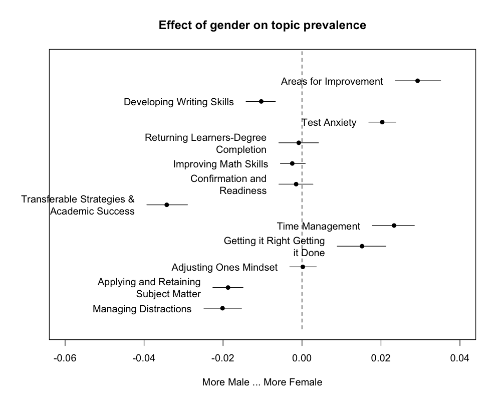

*Gender: female minus male topic prevalence*

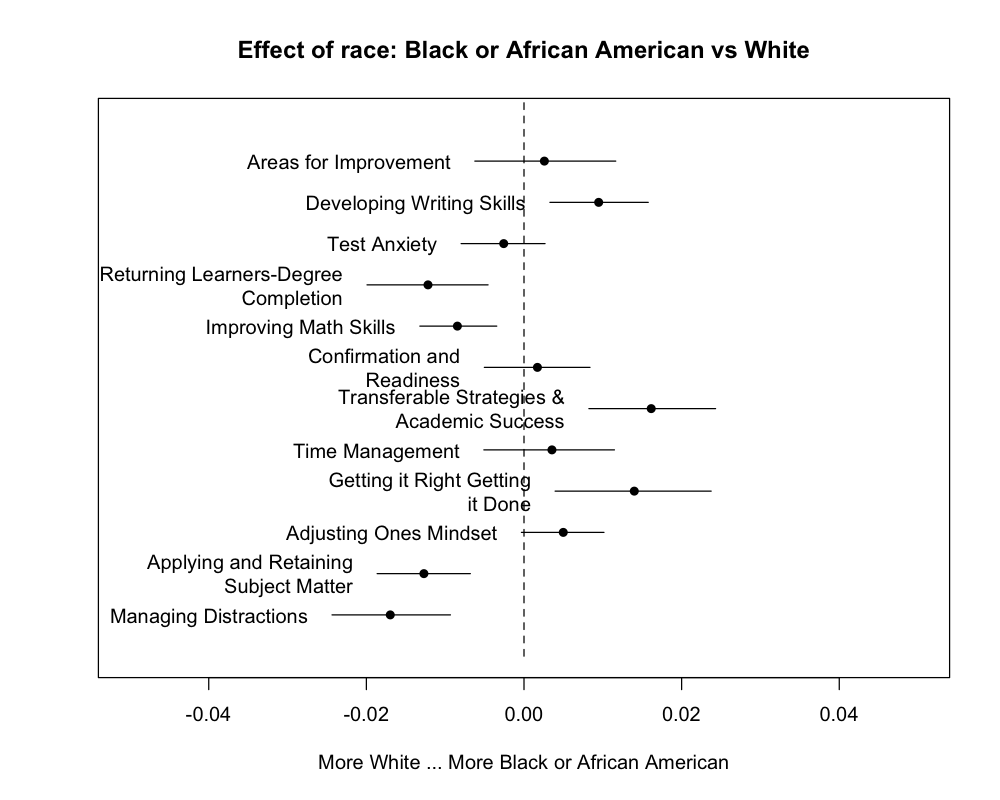

*Race: Black or African American minus White topic prevalence*

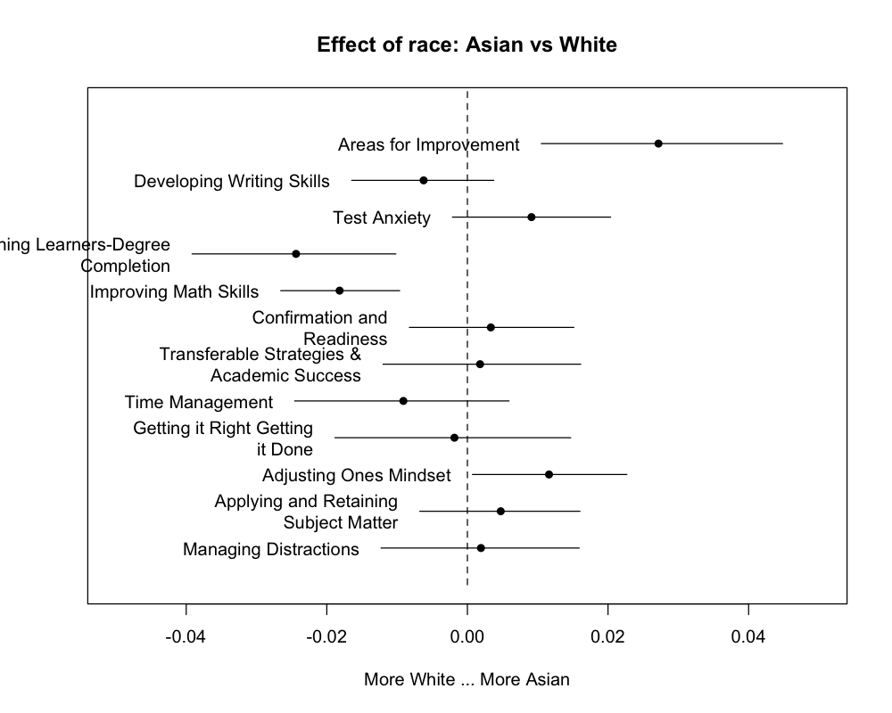

*Race: Asian minus White topic prevalence*

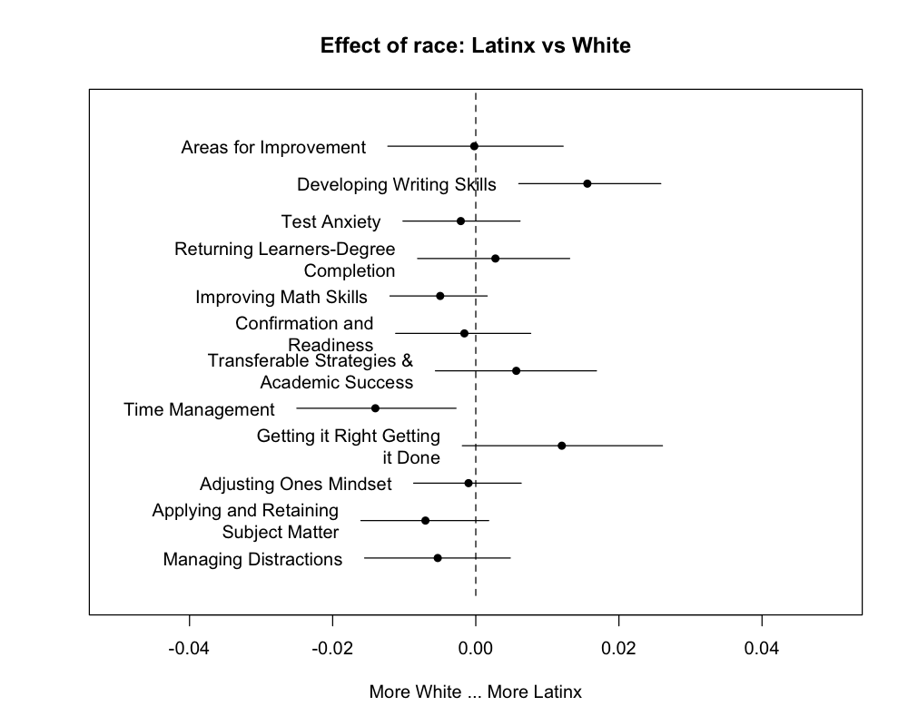

*Race: Latinx minus White topic prevalence*

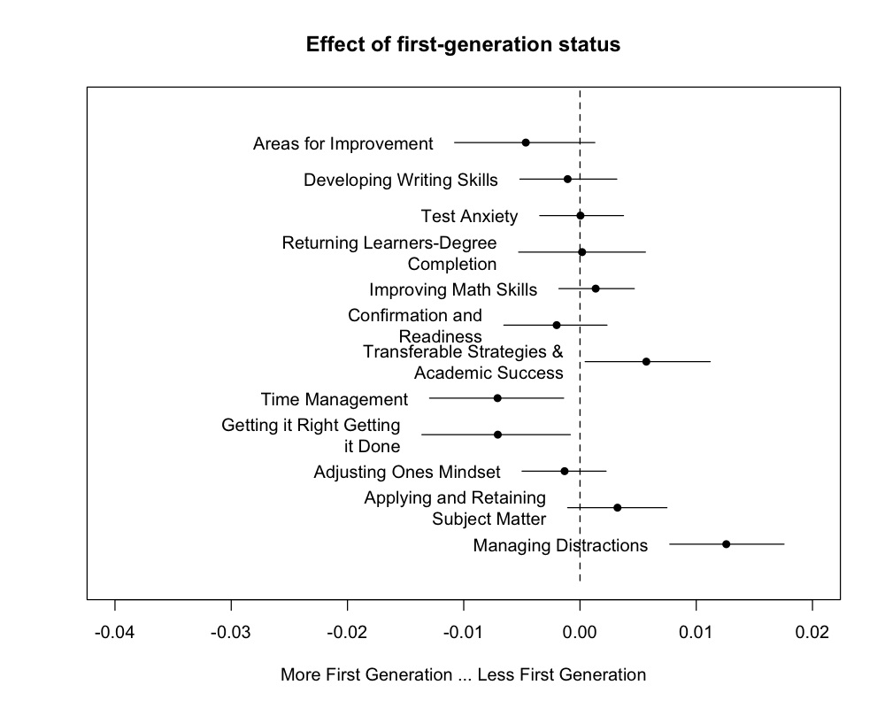

*First-generation status: non-first-gen minus first-gen*

### 4.4 Age

Age is jointly significant for 12 of 12 topics. The three strongest are shown; the relationship is a spline, so direction varies across the age range rather than being a single slope.

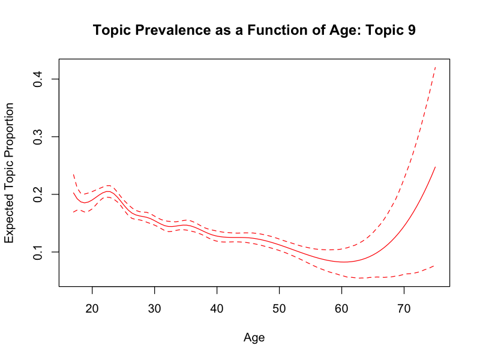

*Topic 9 (Getting it Right Getting it Done) prevalence by age*

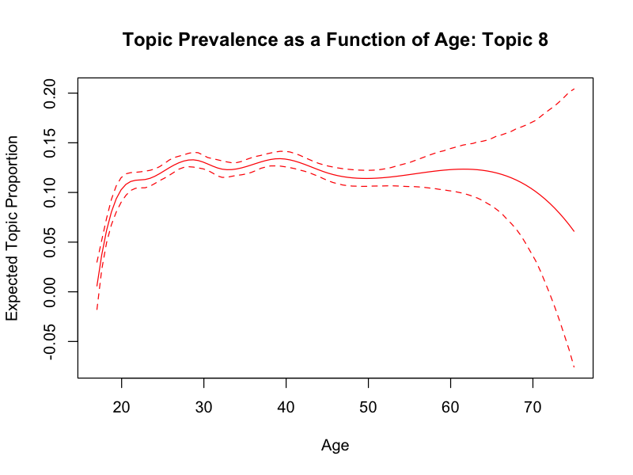

*Topic 8 (Time Management) prevalence by age*

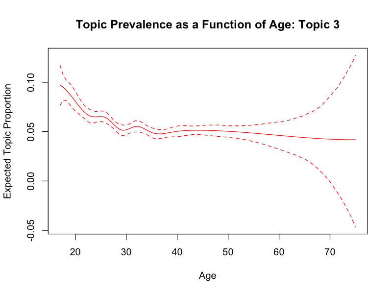

*Topic 3 (Test Anxiety) prevalence by age*

### 4.5 Gender x age interaction

Joint test on the interaction terms only, one per topic, BH-adjusted across topics.

| Topic | Label | F | p | p (BH) | FDR < 0.05 |
|---|---|---|---|---|---|
| 6 | Confirmation and Readiness | 22 | 2.81e-06 | 3.37e-05 | yes |
| 2 | Developing Writing Skills | 5.25 | 0.0219 | 0.0877 | no |
| 8 | Time Management | 5.78 | 0.0162 | 0.0877 | no |
| 3 | Test Anxiety | 0.51 | 0.473 | 0.811 | no |
| 4 | Returning Learners-Degree Completion | 0.68 | 0.408 | 0.811 | no |
| 7 | Transferable Strategies & Academic Success | 0.75 | 0.387 | 0.811 | no |
| 11 | Applying and Retaining Subject Matter | 0.59 | 0.444 | 0.811 | no |
| 1 | Areas for Improvement | 0.15 | 0.703 | 0.838 | no |
| 5 | Improving Math Skills | 0.07 | 0.789 | 0.838 | no |
| 9 | Getting it Right Getting it Done | 0.04 | 0.838 | 0.838 | no |
| 10 | Adjusting Ones Mindset | 0.14 | 0.709 | 0.838 | no |
| 12 | Managing Distractions | 0.15 | 0.697 | 0.838 | no |

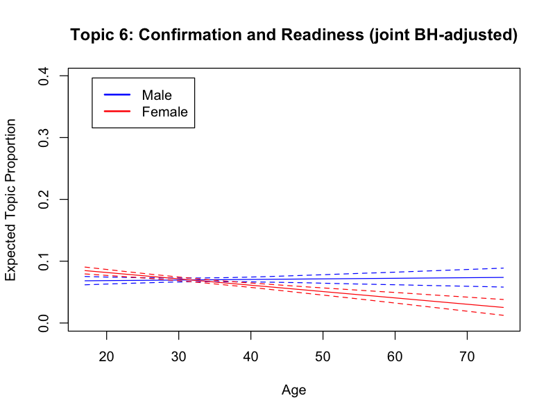

*Topic 6 (Confirmation and Readiness): age curve by gender*

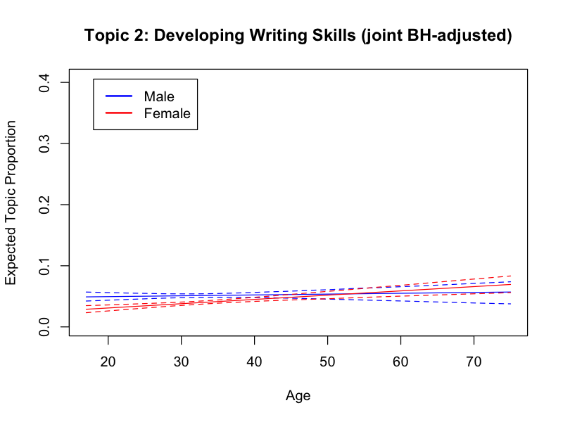

*Topic 2 (Developing Writing Skills): age curve by gender*

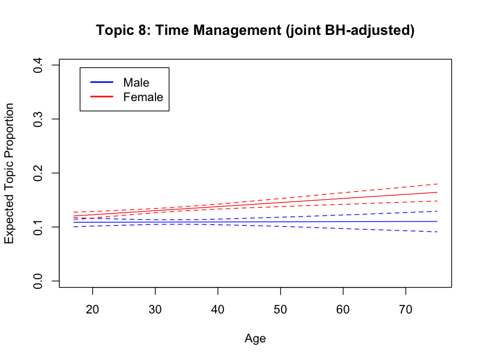

*Topic 8 (Time Management): age curve by gender*

## 5. Topic correlation network

Topics that co-occur within documents above a simple correlation cutoff of 0.05.

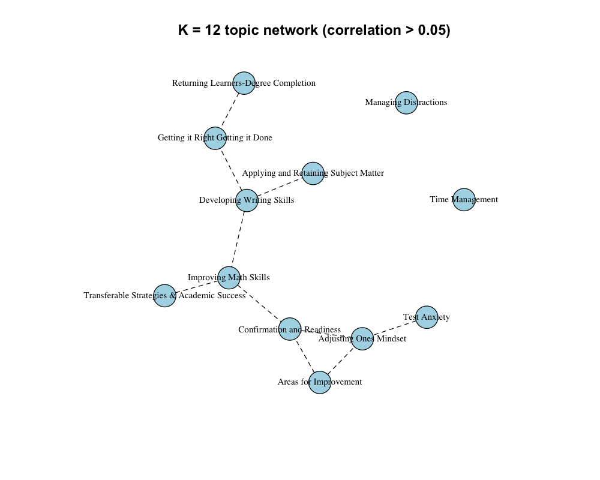

*Topic correlation network*

## 6. Self-regulated learning and topic prevalence

One random forest per topic, predicting that topic's document prevalence from the fourteen SRL scale scores. Variance explained is the forest's own out-of-bag R-squared, so it is an estimate of predictive signal, not a significance test.

| Topic | Label | Documents | Variance explained (%) |
|---|---|---|---|
| 3 | Test Anxiety | 7960 | 21.1 |
| 12 | Managing Distractions | 7960 | 13.2 |
| 10 | Adjusting Ones Mindset | 7960 | 9.26 |
| 1 | Areas for Improvement | 7960 | 8.37 |
| 7 | Transferable Strategies & Academic Success | 7960 | 4.08 |
| 8 | Time Management | 7960 | 0.95 |
| 11 | Applying and Retaining Subject Matter | 7960 | 0.95 |
| 9 | Getting it Right Getting it Done | 7960 | 0.74 |
| 5 | Improving Math Skills | 7960 | -0.71 |
| 4 | Returning Learners-Degree Completion | 7960 | -1.37 |
| 2 | Developing Writing Skills | 7960 | -2.06 |
| 6 | Confirmation and Readiness | 7960 | -3.21 |

**Reading this table.** Out-of-bag R-squared can be negative: it means the forest predicts worse than the mean, which is what a model with no signal looks like. Values near zero should be read as *no detectable relationship*, not as a weak one.

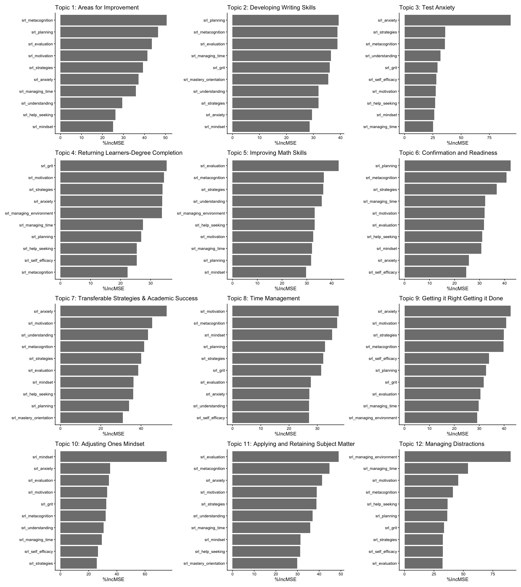

*SRL predictor importance, one panel per topic*

### 6.1 Feedback views (WGU only)

The same approach with the direction reversed: topic proportions as predictors, the number of times a student viewed their DAACS feedback as the response. WGU is the only institution carrying this measure.

| Quantity | Value |
|---|---|
| Documents | 6180 |
| Variance explained (%) | 9.65 |

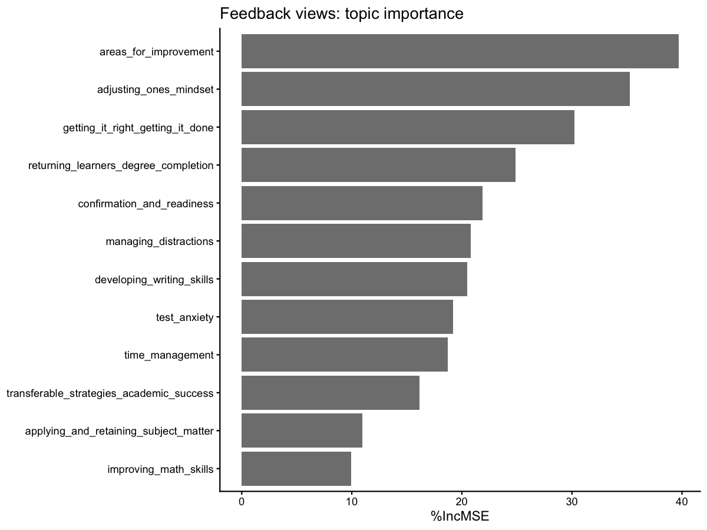

*Topic importance for predicting feedback views*

## 7. Caveats and open items

- **Topic labels are provisional.** Topic 1 is a known weak fit and is retained pending review of its exemplar essays. See `README.md`.
- **K = 12 was chosen by professional judgement**, informed by coherence and exclusivity diagnostics rather than determined by them. See `README.md`.
- **The essay filter has a known gap.** One submission below the 50-unique-word floor remains in the corpus by explicit decision; see `CODE_REVIEW.md` S1-9.
- **No causal claim is supported.** These are associations between topic prevalence and covariates in observational data from three institutions with different intake populations, and institution is not in the prevalence formula.
- **Random forest variance explained is not a hypothesis test** and carries no p-value. Treat small values as absence of signal.
- **Uncorrected p-values appear nowhere in this document except the count table in 4.1**, which exists to show what adjustment changes.
- **Section 4 is reproducible only because it is seeded.** The estimation and its summary are both stochastic; see the note in 4.1.

Generated from commit `74297cd` with `set.seed(20220527)`.

